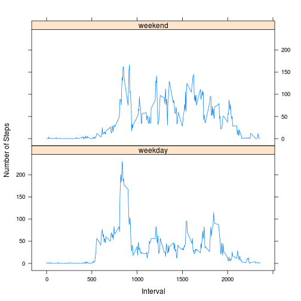

Peer Assessment 1 - Reproducible Research Coursera Class
========================================================
## Paolo Masulli - June 2014

Data analysis assignment of a large amount of data about personal movement using activity monitoring devices. The data consists of two months of data from an anonymous individual collected during the months of October and November, 2012 and include the number of steps taken in 5 minute intervals each day.

### Part 1: Loading and preprocessing the data

We load the data file (activity.csv, assuming it is in the same directory as the script),
and we pre-process it for the subsequent analyses (e.g. trasforming the date column in a 
Date type).


```r
library(lattice)
options(scipen=999)
myData <- read.csv("activity.csv")
myData$date <- as.Date(myData$date)
```

### Part 2: Mean total number of steps taken per day

We remove the rows with NA value of steps and then plot a histogram with the total number of steps per day.


```r
myDataNoNA <- subset(myData,!is.na(myData$steps))
aggrData <- aggregate(myDataNoNA$steps,by=list(myDataNoNA$date),FUN="sum")
with(aggrData,plot(Group.1,x,type="h",xlab="Date",ylab="Number of steps per day"))
```

 

```r
stepsDay <- aggrData$x
avgStepsDay <- round(mean(stepsDay),digits=1)
medianStepsDay <- median(stepsDay)
```

We can see that the average number of steps taken per day is 10766.2 and the median is 10765.

### Part 3: Average daily activity pattern

We make a time series plot of the 5-minute interval and the average number of steps taken, averaged across all days.


```r
aggrDataInterval <- aggregate(myDataNoNA$steps,by=list(myDataNoNA$interval),FUN="mean")
with(aggrDataInterval,plot(Group.1,x,type="l",xlab="Time interval",ylab="Average number of steps"))
```

 

```r
maxInterval <- which.max(aggrDataInterval$x)
maxStepsInterval <- aggrDataInterval$x[which.max(aggrDataInterval$x)]
```

We can see that the interval with the maximum number of steps in average is the interval 104, where the average number of steps taken is 206.1698.

### Part 4: Treating missing value

Note that there are a number of days/intervals where there are missing values (coded as NA). The presence of missing days may introduce bias into some calculations or summaries of the data. We complete the data filling the missing values of the steps number with the average number of steps in the corresponding time interval over all days.
Note that for each interval we have at least one day where the corresponding number of steps is available, therefore this way we remove all the NA's.

We create a new data frame, equal to the original one, but with all the NA's replaced with the strategy explained above.


```r
numberNArows <- sum(!complete.cases(myData))

a <- myData$steps
b <- aggrDataInterval$x
replacedValues <- ifelse(is.na(a),b,a)
myDataReplaced <- myData
myDataReplaced$steps <- replacedValues

completeDataAggregated <- aggregate(myDataReplaced$steps,by=list(myDataReplaced$date),FUN="sum")
completeStepsDay <- completeDataAggregated$x
completeStepsAvg <- mean(completeStepsDay)
completeStepsMedian <- median(completeStepsDay)
differenceAvg <- round(abs((avgStepsDay-completeStepsAvg)/avgStepsDay)*100,digits=1)
differenceMedian <- round(abs((medianStepsDay-completeStepsMedian)/medianStepsDay)*100,digits=1)
```

We plot a histogram of the total number of steps per day using the new data set with replaced values. We can see that the average number of steps taken per day is 10766.2 and the median is 10765. This means that the difference for the average is of 0 steps for the average number of steps per day between the two data sets, and of 0 steps for the median, i.e. there is no difference. This makes sense, since we are replacing the missing value with the average of all the others, and since each time interval is observed for the same number of days.


```r
with(completeDataAggregated,plot(Group.1,x,type="h",xlab="Time interval",ylab="Average number of steps"))
```

 

### Part 5: Activity patterns on weekdays and weekends

We want to study differences in the activity patterns between weekdays and weekends. To do so we create a new factor variable (dayType) in the dataset with two levels – “weekday” and “weekend” indicating whether a given date is a weekday or weekend day.


```r
myDataReplaced$dayType <- ifelse(weekdays(myDataReplaced$date) == "Saturday" | 
                                   weekdays(myDataReplaced$date) == "Sunday",
                                 "weekend","weekday")
myDataReplaced$dayType <- as.factor(myDataReplaced$dayType)
```

Then we aggregate the data by time interval and day type and plot the average number of steps per time interval respectively on weekends and weekdays.


```r
aggregatedDataIntervalDay <- aggregate(myDataReplaced$steps,by=list(myDataReplaced$interval,myDataReplaced$dayType),FUN="mean")
with(aggregatedDataIntervalDay,xyplot(x~Group.1|Group.2,type="l",layout=c(1,2),xlab="Interval",ylab="Number of Steps"))
```

 
